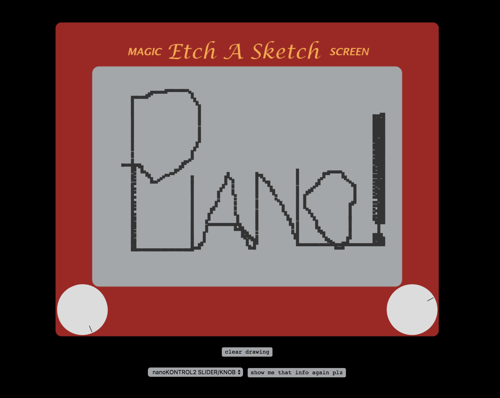

# Etch A Sketch MIDI piano

web application made by [jen hill](www.jh-sound.com) that lets users draw and sonify an Etch A Sketch drawing via MIDI protocol

for use with USB midi device:

connect midi controller && it should appear in the dropdown menu below the screen (you may need to refresh the page after plugging controller in)

click on a dial && turn a knob on yr MIDI controller to assign it to that dial ~~ reassign the dial to a new MIDI control knob by clicking again && turning a new knob

if no MIDI controller is available, user can draw pixels using the up/right/left/down arrow keys, even though this isn't nearly as much fun as MIDI

www.jh-sound.com